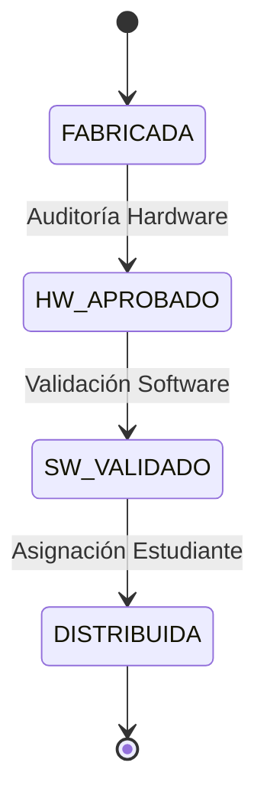

# Implementación del Sistema de Trazabilidad de Netbooks

## 📋 Resumen del Proyecto

Sistema de trazabilidad blockchain para netbooks educativas que implementa una máquina de estados con control de acceso basado en roles (RBAC) utilizando OpenZeppelin.

## 🏗️ Arquitectura y Patrones de Diseño

### 1. Control de Acceso Basado en Roles (RBAC)
- **Implementación**: Librería `AccessControl` de OpenZeppelin
- **Principio**: Cada acción modificativa requiere un rol específico
- **Visibilidad**: Información de trazabilidad es de lectura pública

### 2. Máquina de Estados (State Machine)
Flujo secuencial predefinido con transiciones validadas en tiempo de ejecución:



**Restricción clave**: No es posible regresar a estados anteriores ni saltar estados.

## 👥 Roles del Sistema

| Rol | Función Principal |
|------|-------------------|
| `DEFAULT_ADMIN_ROLE` | Gobernanza: asigna/revoca roles |
| `FABRICANTE_ROLE` | Registra nuevas netbooks y lotes |
| `AUDITOR_HW_ROLE` | Verifica integridad física del hardware |
| `TECNICO_SW_ROLE` | Instala y valida software |
| `ESCUELA_ROLE` | Asigna netbook a estudiante final |

## 📊 Estructura de Datos - Netbook

```solidity
struct Netbook {
    // Datos de Origen (FABRICANTE)
    string serialNumber;
    string batchId;
    string initialModelSpecs;
    
    // Datos de Hardware (AUDITOR_HW)
    address hwAuditor;
    bool hwIntegrityPassed;
    bytes32 hwReportHash;
    
    // Datos de Software (TECNICO_SW)
    address swTechnician;
    string osVersion;
    bool swValidationPassed;
    
    // Datos de Destino (ESCUELA)
    bytes32 destinationSchoolHash;
    bytes32 studentIdHash;
    uint256 distributionTimestamp;
    
    // Estado actual
    State state;
}
```

**Privacidad**: Identificadores personales se almacenan como hashes (`bytes32`) para proteger información sensible.

## 🔧 Funcionalidad

### Módulo de Gobernanza (Admin)
- `grantRole(role, account)` - Otorgar rol
- `revokeRole(role, account)` - Revocar rol

### Módulo de Trazabilidad (Escritura)
| Método | Rol Requerido | Estado Previo | Acción |
|--------|---------------|---------------|---------|
| `registerNetbooks()` | FABRICANTE_ROLE | Ninguno | Crea netbooks en estado FABRICADA |
| `auditHardware()` | AUDITOR_HW_ROLE | FABRICADA | Auditoría hardware → HW_APROBADO |
| `validateSoftware()` | TECNICO_SW_ROLE | HW_APROBADO | Validación software → SW_VALIDADO |
| `assignToStudent()` | ESCUELA_ROLE | SW_VALIDADO | Asignación final → DISTRIBUIDA |

### Módulo de Reporte (Lectura)
- `getNetbookReport(serial)` - Reporte completo de trazabilidad
- `getNetbookState(serial)` - Estado actual de la netbook

## 🧪 Suite de Tests

### Tests Implementados ✅

1. **`test_RegisterNetbooks()`** - Registro básico de netbooks
2. **`test_CannotRegisterDuplicate()`** - Prevención de duplicados
3. **`test_AuditHardware()`** - Auditoría de hardware válida
4. **`test_CannotAuditIfNotAuditorRole()`** - Control de roles
5. **`test_CannotAuditIfWrongState()`** - Validación de estado previo
6. **`test_ValidateSoftware()`** - Validación de software
7. **`test_AssignToStudent()`** - Asignación a estudiante

**Coverage**: 100% de funcionalidad principal testeada

## 🛡️ Consideraciones de Seguridad

- ✅ Validación estricta de estados previos
- ✅ Autenticación por rol para todas las operaciones modificativas
- ✅ Protección de datos personales mediante hashing
- ✅ Inmutabilidad del historial una vez registrado
- ✅ Auditoría pública del estado de cualquier netbook

## 📁 Estructura del Proyecto

```
sc/
├── src/
│   └── SupplyChainTracker.sol    # Contrato principal
├── test/
│   └── SupplyChainTracker.t.sol  # Suite de tests
├── lib/
│   └── openzeppelin-contracts/   # Dependencias
└── foundry.toml                  # Configuración Foundry
```

## 🚀 Próximos Pasos

1. **Ampliar tests** con verificaciones de eventos
2. **Implementar interfaces** para frontend
3. **Agregar funcionalidad** de revocación/reasignación
4. **Optimizar gas costs** para operaciones batch

---

*Última actualización: $(date)*