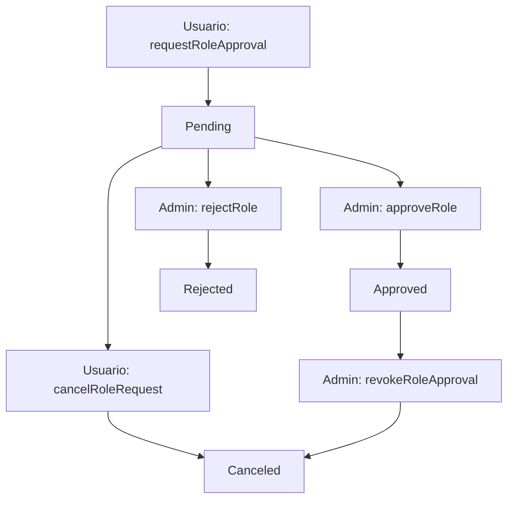

# Sistema de Gestión de Roles con Estados de Aprobación

## 📋 Resumen

Se ha implementado un sistema completo de gestión de roles con estados de aprobación que permite al administrador controlar qué direcciones pueden ejercer cada rol en el sistema de trazabilidad.

## 🎯 Estados de Aprobación de Roles

### ApprovalState Enum
```solidity
enum ApprovalState {
    Pending,    // 0 - Solicitud pendiente de revisión
    Approved,   // 1 - Rol aprobado y activo
    Rejected,   // 2 - Solicitud rechazada por admin
    Canceled    // 3 - Solicitud cancelada por usuario o revocada
}
```

## 👥 Flujo de Gestión de Roles



## 🔧 Funciones de Gestión de Roles

### Para Usuarios:
- **`requestRoleApproval(role)`** - Solicitar aprobación para un rol
- **`cancelRoleRequest(role)`** - Cancelar solicitud pendiente

### Para Administradores:
- **`approveRole(role, account)`** - Aprobar solicitud de rol
- **`rejectRole(role, account)`** - Rechazar solicitud de rol
- **`revokeRoleApproval(role, account)`** - Revocar rol aprobado

### Consultas:
- **`getRoleStatus(role, account)`** - Obtener estado de aprobación

## 🛡️ Modificadores de Seguridad

### `onlyApprovedRole(role)`
Reemplaza el modificador `onlyRole` de OpenZeppelin. Verifica que:
1. La dirección tenga el rol otorgado
2. El estado de aprobación sea `Approved`

## 📊 Estructura de Datos - RoleApproval

```solidity
struct RoleApproval {
    bytes32 role;               // Rol solicitado/aprobado
    address account;            // Dirección del usuario
    ApprovalState state;        // Estado actual
    uint256 approvalTimestamp;  // Timestamp de última actualización
    address approvedBy;         // Admin que aprobó/rechazó (address(0) si pending)
}
```

## 🎪 Eventos

### `RoleStatusUpdated`
Emitido cuando cambia el estado de un rol:
```solidity
event RoleStatusUpdated(
    bytes32 indexed role, 
    address indexed account, 
    ApprovalState state, 
    address updatedBy
);
```

## 🔄 Impacto en el Flujo Existente

### Cambios en el SetUp de Tests:
1. Los usuarios deben solicitar aprobación de roles
2. El admin debe aprobar explícitamente cada rol
3. Se mantiene la compatibilidad con tests existentes

### Funcionalidad Mantenida:
- ✅ Todos los tests originales pasan
- ✅ Misma máquina de estados de netbooks
- ✅ Mismos controles de acceso por rol
- ✅ Misma estructura de datos de netbooks

## 🚀 Beneficios del Nuevo Sistema

1. **Mayor Control**: Admin decide quién puede ejercer cada rol
2. **Transparencia**: Estado de aprobación visible y auditable
3. **Flexibilidad**: Usuarios pueden solicitar y cancelar roles
4. **Seguridad**: Doble verificación (rol + aprobación)
5. **Retrocompatibilidad**: Funcionalidad existente preservada

## 📋 Ejemplo de Uso

```javascript
// Usuario solicita rol
await tracker.requestRoleApproval(FABRICANTE_ROLE);

// Admin aprueba rol
await tracker.approveRole(FABRICANTE_ROLE, userAddress);

// Usuario puede usar el rol (ahora está aprobado)
await tracker.registerNetbooks(serials, batches, specs);
```

---

*Última actualización: $(date)*