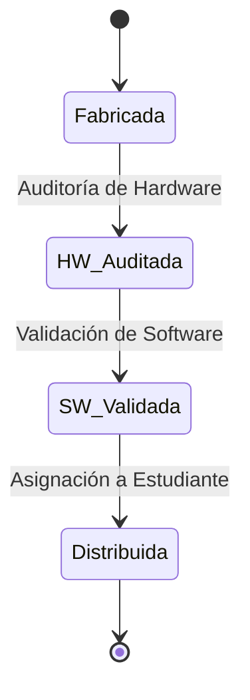

# Flujo de Trazabilidad - SupplyChainTracker

## Introducción
Este documento describe el flujo de trazabilidad de netbooks en el sistema **SupplyChainTracker**, incluyendo los eventos emitidos por el contrato inteligente y cómo interactuar con ellos desde el frontend.

---

## Flujo del Ciclo de Vida
El ciclo de vida de una netbook consta de **4 pasos principales**, cada uno representado por un estado en el contrato inteligente:



### 1. **Fabricada (Registered)**
- **Responsable**: Fabricante.
- **Acción**: Registrar la netbook en el sistema.
- **Datos registrados**:
  - Número de serie.
  - ID de lote.
  - Especificaciones iniciales.
- **Evento emitido**: `NetbookRegistered`.

### 2. **HW Auditada (Hardware Audited)**
- **Responsable**: Auditor de hardware.
- **Acción**: Auditar el hardware de la netbook.
- **Datos registrados**:
  - Resultado de la auditoría (aprobado/reprobado).
  - Hash del reporte de auditoría.
- **Evento emitido**: `HardwareAudited`.

### 3. **SW Validada (Software Validated)**
- **Responsable**: Técnico de software.
- **Acción**: Validar el software de la netbook.
- **Datos registrados**:
  - Versión del sistema operativo.
  - Resultado de la validación (aprobado/reprobado).
- **Evento emitido**: `SoftwareValidated`.

### 4. **Distribuida (Delivered)**
- **Responsable**: Escuela.
- **Acción**: Asignar la netbook a un estudiante.
- **Datos registrados**:
  - Hash de la escuela.
  - Hash del ID del estudiante.
  - Timestamp de distribución.
- **Evento emitido**: `AssignedToStudent`.

---

## Eventos del Contrato
El contrato emite los siguientes eventos durante el ciclo de vida de una netbook:

| Evento                  | Parámetros                                                                 | Descripción                                      |
|-------------------------|---------------------------------------------------------------------------|--------------------------------------------------|
| `NetbookRegistered`     | `serialNumber`, `batchId`, `initialModelSpecs`                           | Netbook registrada por el fabricante.            |
| `HardwareAudited`       | `serialNumber`, `auditor`, `passed`, `reportHash`                        | Hardware auditado por el auditor.                |
| `SoftwareValidated`     | `serialNumber`, `technician`, `osVersion`, `passed`                      | Software validado por el técnico.                |
| `AssignedToStudent`     | `serialNumber`, `schoolHash`, `studentHash`                              | Netbook asignada a un estudiante.                |
| `RoleStatusUpdated`     | `role`, `account`, `state`, `updatedBy`                                  | Estado de solicitud de rol actualizado.          |

---

## Escuchar Eventos desde el Frontend
Para escuchar eventos desde el frontend, usa el método `setupEventListener` de `Web3Service`. Ejemplo:

```typescript
// Ejemplo: Escuchar el evento NetbookRegistered
web3Service.setupEventListener("NetbookRegistered", (event) => {
  console.log("Netbook registrada:", event.args.serialNumber);
  // Actualizar la UI o notificar al usuario
});

// Ejemplo: Escuchar el evento HardwareAudited
web3Service.setupEventListener("HardwareAudited", (event) => {
  console.log("Hardware auditado:", event.args.serialNumber);
  // Actualizar la UI o recargar datos
});
```

---

## Flujo de Datos en el Frontend
1. **Búsqueda de Netbooks**:
   - Usa `TraceabilityService.fetchNetbookReport(serialNumber)` para obtener los datos de una netbook.
   - Usa `TraceabilityService.fetchNetbookLifecycleStep(serialNumber)` para obtener el estado actual.

2. **Visualización del Ciclo de Vida**:
   - El componente `LifecycleProgress` muestra el progreso del ciclo de vida.
   - Usa `TraceabilityService.getLifecycleStepDetails(serialNumber, step)` para obtener detalles de cada paso.

3. **Transacciones**:
   - Usa `useWeb3().executeTx()` para ejecutar transacciones y manejar estados de carga/error.

---

## Ejemplo de Integración
```typescript
// 1. Obtener datos de una netbook
const report = await traceabilityService.fetchNetbookReport("SN12345678");

// 2. Obtener el estado actual
const currentStep = await traceabilityService.fetchNetbookLifecycleStep("SN12345678");

// 3. Obtener detalles de un paso específico
const details = await traceabilityService.getLifecycleStepDetails(
  "SN12345678",
  LifecycleStep.HardwareAudited
);

// 4. Ejecutar una transacción
const txHash = await useWeb3().executeTx(
  traceabilityService.auditHardware("SN12345678", true, "0x123...")
);
```

---

## Notas Técnicas
- **Autocompletado**: El contrato no expone una función para obtener todos los números de serie. En producción, se recomienda:
  - Usar un índice fuera de la cadena (ej: base de datos).
  - Escuchar eventos para mantener un índice actualizado.
- **Seguridad**: Todos los hashes (ej: `schoolHash`, `studentHash`) deben ser generados usando funciones criptográficas seguras (ej: `keccak256`).
- **Errores**: Maneja errores en transacciones usando `useWeb3().executeTx()` para mostrar feedback al usuario.