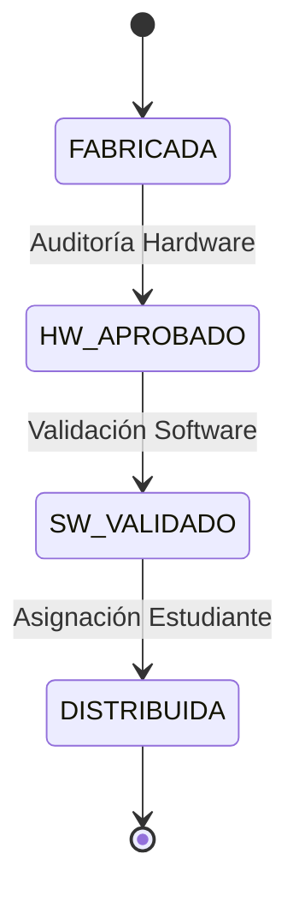

# Diagrama UML - Máquina de Estados



## Descripción de Estados

- **FABRICADA**: Netbook registrada por el fabricante
- **HW_APROBADO**: Hardware auditado y aprobado  
- **SW_VALIDADO**: Software instalado y validado
- **DISTRIBUIDA**: Asignada a estudiante final

**Restricción**: Flujo estrictamente secuencial sin retroceso.
```